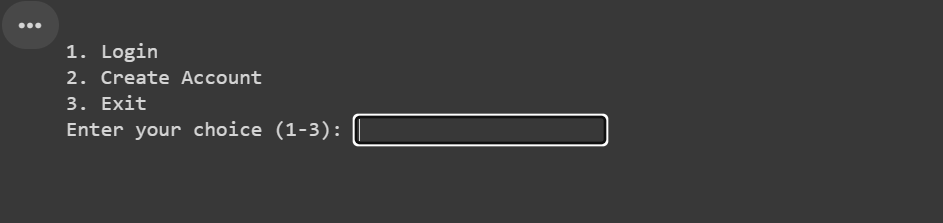

# User Authentication and Astronomy Data Retrieval System

This project is a Python-based CLI application that provides user authentication, including account creation, login, and password reset functionalities. Once logged in, users can also fetch and display astronomy data (e.g., sunrise, sunset, solar noon) for any given location using an external API.

## Table of Contents

1. [Features](https://chatgpt.com/c/67004cce-7e14-8003-80a4-d284e3ecd1dc#features)
2. [Requirements](https://chatgpt.com/c/67004cce-7e14-8003-80a4-d284e3ecd1dc#requirements)
3. [Installation](https://chatgpt.com/c/67004cce-7e14-8003-80a4-d284e3ecd1dc#installation)
4. [Usage](https://chatgpt.com/c/67004cce-7e14-8003-80a4-d284e3ecd1dc#usage)
5. [Security](https://chatgpt.com/c/67004cce-7e14-8003-80a4-d284e3ecd1dc#security)
6. [File Structure](https://chatgpt.com/c/67004cce-7e14-8003-80a4-d284e3ecd1dc#file-structure)
7. [API Information](https://chatgpt.com/c/67004cce-7e14-8003-80a4-d284e3ecd1dc#api-information)

## Features

* **User Account Creation** : Users can create an account by providing a valid email, password, and a security question for password recovery.
* **Login and Password Reset** : Users can log in to their accounts, and if they forget their password, they can reset it by answering their security question.
* **CAPTCHA Verification** : During login, users must complete a CAPTCHA verification to prevent automated login attempts.
* **Astronomy Data Fetching** : After logging in, users can retrieve astronomy data (like sunrise, sunset, and day length) for any city or location by using a public API.
* **Action Logging** : All major actions like account creation, login attempts, password resets, and data fetching are logged to track user activity.

## Requirements

* Python 3.6+
* Required Python packages:
  * `bcrypt`: For password hashing.
  * `requests`: To fetch data from the astronomy API.
  * `csv`: To read and write user and history data.
  * `re`: For email and password validation using regular expressions.
  * `datetime` and `timedelta`: For working with date and time data.
  * `getpass`: To securely take hidden password input.
  * `random` and `string`: For generating CAPTCHA codes.

